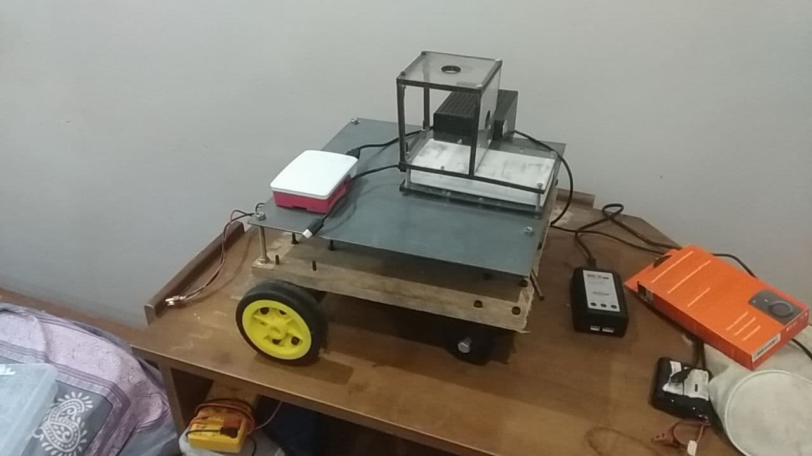
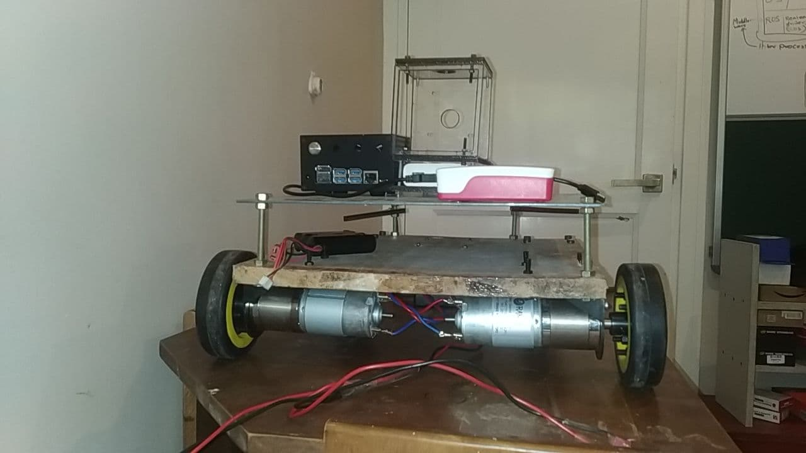

# Raiden

Repository for Sabertooth 2X32 . ROS connectivity .

-  https://github.com/MomsFriendlyRobotCompany/pysabertooth

## Install the dependencies 

	sudo pin install pysabertooth

## Run the Code 

To test the Motor Controller without the ROS wrapper

	python TEST.py 

To test the Motor controller with ROS 

	python saber.py

## Pictures of the RObot

